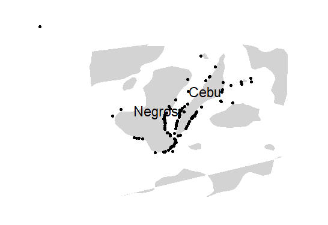
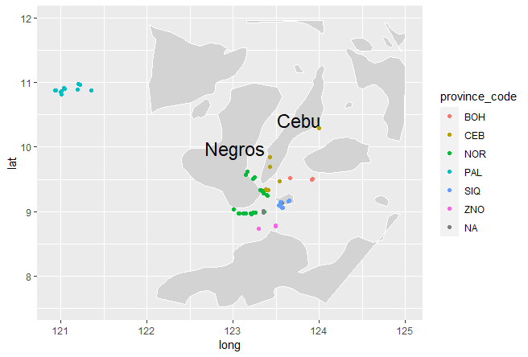
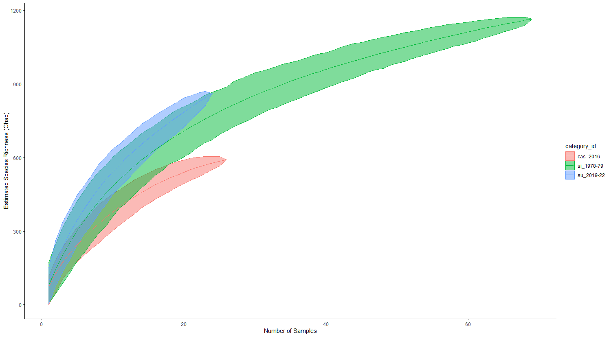
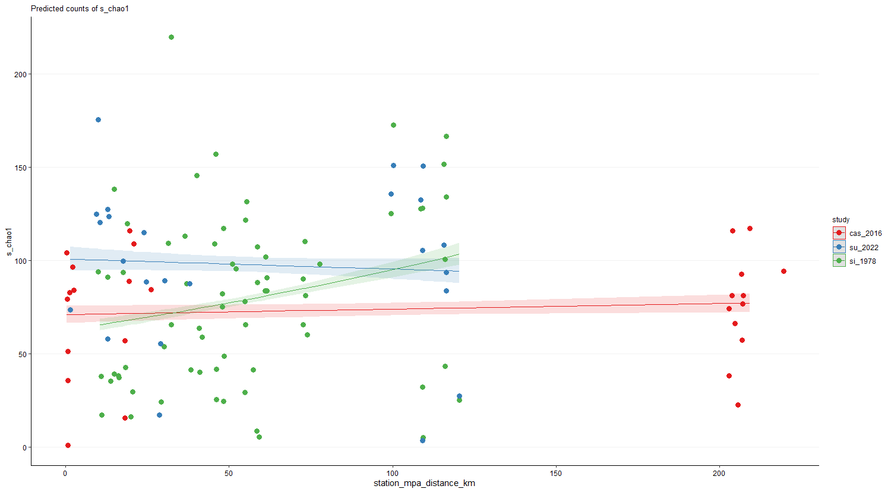
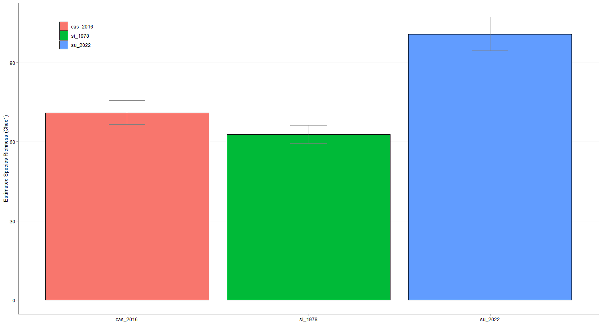
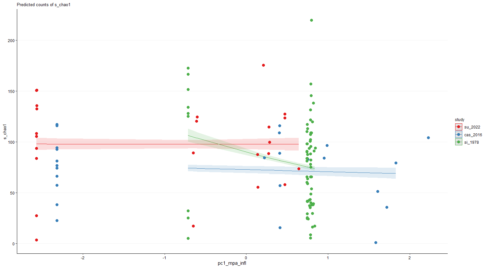
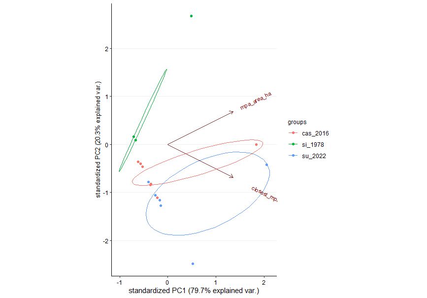
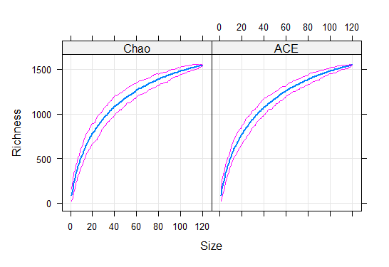

## Figures README ##
#### Not all figures displayed ####

Map of MPA locations used in the analyses
File: figure_mpa_coordinates.png

Map of sample sites used in the analyses
File: figure_sample_sites.png

Accumulation curves separated by era
File: Rplot_species-accumulation-curve.png

Species Richness vs Distance to MPA
File: Rplot_s_vs_dist-to-mpa.png

Y-intercepts of Species Richness vs Distance to MPA plot
File: Rplot_yintercepts_s-vs-distancetonearestmpa.png

Species Richness vs MPA Age and Size
File: Rplot_SvsPC1ofMPAageAndSize.png

Y-intercepts of Species Richness vs MPA Age and Size plot
File: Rplot_yintercept_SvsPC1ofMPAageAndSize.png

PCA graph of MPA area size and distance to closest MPA
File: Rplot.png

Estaccum R plot
File: figure_estaccumR_plot.png
