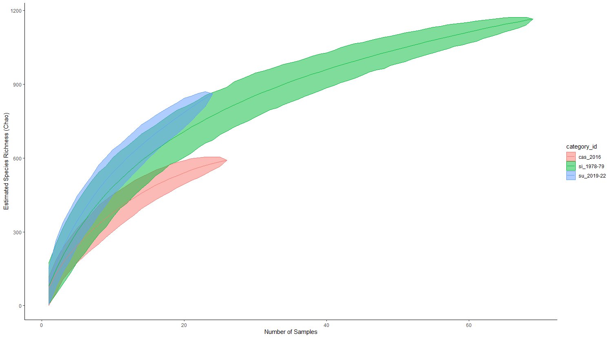
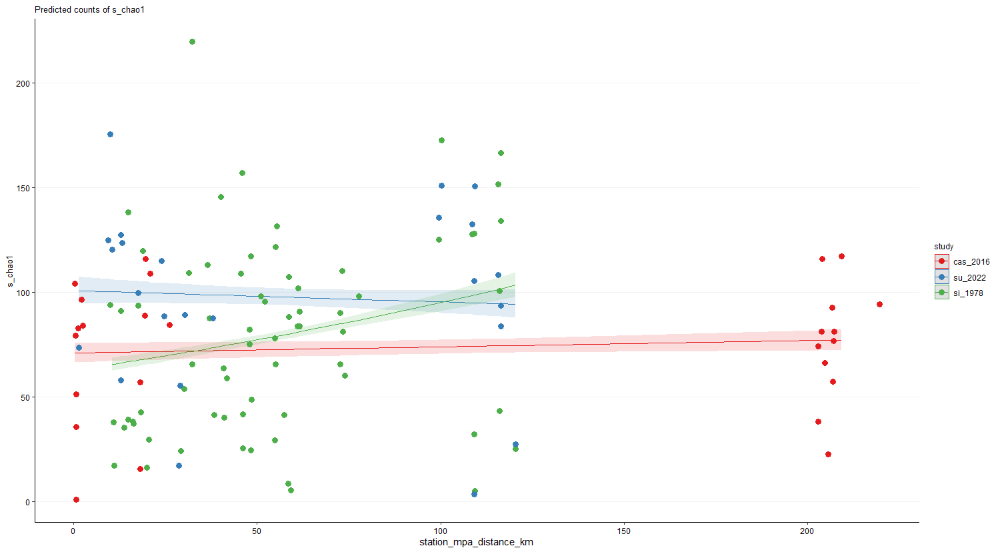

# Relevant Figures README #
## Contains accumulation curve by era, plots of PCA, plots of S vs MPA influences, and MPA/site maps

---

Map of MPA locations used in the analyses

File: `figure_mpa_coordinates.png`

---

Map of sample sites used in the analyses

File: `figure_sample_sites.png`

---

Accumulation curves separated by era
* Shows estimated true value of species richness for each era

File: `Rplot_species-accumulation-curve.png`

---

Species Richness vs Distance to MPA
* Shows the relationship of species richness to distance from MPA.
* Distance to MPA only affects species richness in 1978-79; and it is a negative relationship
File: `Rplot_s_vs_dist-to-mpa.png`

---

Y-intercepts of Species Richness vs Distance to MPA plot
* Shows the difference in values for species richness for each era at x=0
* Species richness was highest in 2019-2022, and lowest in 1978-79

File: `Rplot_yintercepts_s-vs-distancetonearestmpa.png`

---

Species Richness vs MPA Age and Size
* Shows the relationship of species richness to MPA age and size (PC1).
* Species richness only changes with MPA age and size (PC1) in 1978-79; and it is a negative relationship

File: `Rplot_SvsPC1ofMPAageAndSize.png`

---

Y-intercepts of Species Richness vs MPA Age and Size plot
* Shows the difference in values for species richness for each era at x=0
* Species richness was highest in 2019-2022, and lowest in 2016

File: `Rplot_yintercept_SvsPC1ofMPAageAndSize.png`

---

PCA graph of MPA area size and distance to closest MPA

File: `Rplot.png`

---

Estaccum R plot
* Estimate extrapolated richness indices of count data. If looking at 120 sites, it's estimated ~1500 species present
* Chao = Bias corrected
* ACE = Abundance Based Estimate. Uses counts (numbers of individuals) of species in a single site

File: `figure_estaccumR_plot.png`
